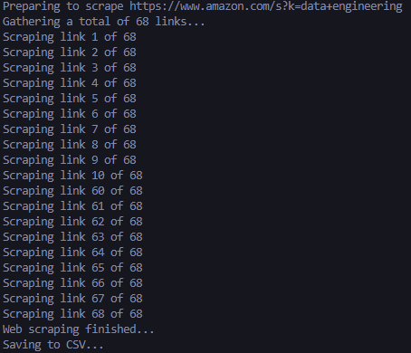

Python Amazon Web Scraper
===

## Description
This is a Python web scraper that scrapes product data from Amazon using BeautifulSoup and then stores that data as a CSV file. This project was created as a mini project to get better aquainted with different Python libraries such as BeautifulSoup, Requests, numPy, and Pandas and also to kickstart my learning and understanding of Data Engineering and simple ETL processes.

---

## Requirements
This project requires you to clone this repo to your machine and have the following technologies installed:
- [Python](https://www.python.org/)
  - [BeautifulSoup4](https://pypi.org/project/beautifulsoup4/)
  - [Requests](https://requests.readthedocs.io/en/latest/)
  - [Pandas](https://pandas.pydata.org/)
  - [NumPy](https://numpy.org/)

---

## Usage
After you clone this repo to your machine and you have installed the latest versions of the requirements, you will need to add some information specific to a couple of variables for your use case.

Inside of the `app.py` file, provide a string containing a parsed user agent to the `USER_AGENT` variable on line 11.

After that, you will also provide a string containing the keywords you which to search for on Amazon to the `KEYWORDS` variable on line 16.

Once you have provided values to those two variables, navigate to the root directory of the cloned repo and run `python app.py`

You should see ouput on your terminal similar to the picture below.

 
> Note: Your terminal will look different depending on your `KEYWORDS` and also depending on how many product links were discovered based on your search query. This screenshot of the terminal output was edited to fit as a smaller picture. Your terminal should display a line for each and every link it is scraping and not jump from line 10 to line 60 like in the picture above.

---

## Conclusion

My main goal with this project was to explore the data world a bit more and wrap my head around Extract-Transform-Load (ETL) processes a bit more, even if from a single source, as my interest in Data Engineering grows. Here's how I see the ETL process is used in this project:

### **Extract**

> Data is extracted from the scraped Amazon page of the specific keywords provided. The inital scraping of the entire page is done in the `app.py` file but the specific data that we are looking for like `title`, `price`, `rating`, `reviews`, and `availability` are all specified in the `amazon_scraper.py` file. This was also the reason I chose to separate those specific functions from the main file.

### **Transform**

> There vas very minimal transforming done to the data in this project. The most that we did was cleaning the data of any trailing and leading whitespaces by using the `.strip()` method. There were also `try..except` clauses to return an empty string in the even that an error occured during the extraction process.

### **Load**

> Once the data is fully extracted and store in the dictionary `products_dict`, it is then saved as a CSV file called `amazon_data.csv` inside of the `data` folder. Provided with this project is an example CSV file found at `data/example_amazon_data.csv` that was created by this program using the keywords `'Data Engineering'`.

Potential next steps and ideas:
- Determine what other data could be useful to extract from specific product pages
- Add functionality to scrape multiple products
- Add functionality to scrape more than just the initial page given after submiting search query
- Store files with specific naming convention based on keywords and timestamp
- Add more  transformations to the data before storing
- Conduct exploratory data analysis on CSV file 
---

## License
>You can check out the full license [here](LICENSE)

This project is licensed under the terms of the **MIT** license.